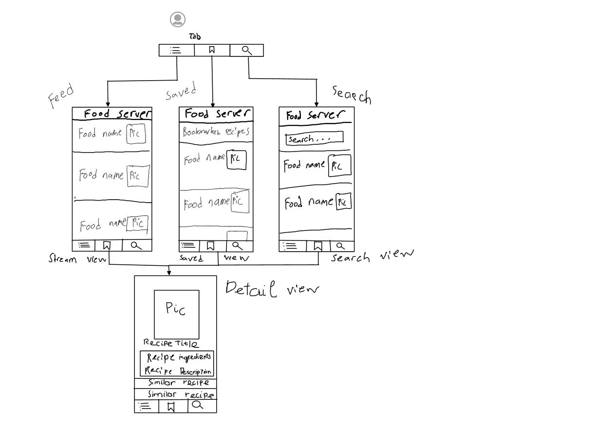

# Milestone 1 - Recipe Server

## Table of Contents

1. [Overview](#Overview)
1. [Product Spec](#Product-Spec)
1. [Wireframes](#Wireframes)

## Overview

### Description
View Recipes online and save them for later. Useful for homecooks.

### App Evaluation

[Evaluation of your app across the following attributes]
- **Category:** Food, lifestyle
- **Mobile:** Ability to save recipes found online.
- **Story:** Gives users recipe ideas for what to cook in their next meal
- **Market:** Anyone who wants likes to cook and has trouble finding recipes. Also for anyone who wants to try out new recipes and expand their cooking.
- **Habit:** The app would be useful for meal ideas before cooking. This app has the potential to be used on a daily basis and possibly multiple times a day.
- **Scope:** Main features are accessing a food database and saving recipe ideas for later in the phone's database. V2 will allows user to see similar recipe to the ones they choose.

## Product Spec

### 1. User Features (Required and Optional)

**Required Features**

* User must be able to save their recipes for later.
* User can generate recipes at random.
* User delete recipes from saved recipe list.
* User can see the ingredients and nutrition of the recipe 

**Stretch Features**

* [fill in your optional user features here]
* Implement a search feature to search for a specific recipe or search for recipes using certain ingredients.
* Suggest similar recipes to the one that they saved
* User can share the recipe through emails, text, etc,.

### 2. Screen Archetypes

- Stream Online
  - Users can see a list of recipes online
- Stream local
    - Users can see a list of saved recipe
- Detail
  - Users can see a list of recipes they saved online

### 3. Navigation

**Tab Navigation** (Tab to Screen)

- Feed
    - Online Recipes
- Saved 
    - Saved Recipes

**Flow Navigation** (Screen to Screen)

- Online Recipes
  - Details/add
- Saved Recipes
  - Details/delete

## Wireframes

[Add picture of your hand sketched wireframes in this section]

### [BONUS] Digital Wireframes & Mockups

### [BONUS] Interactive Prototype
